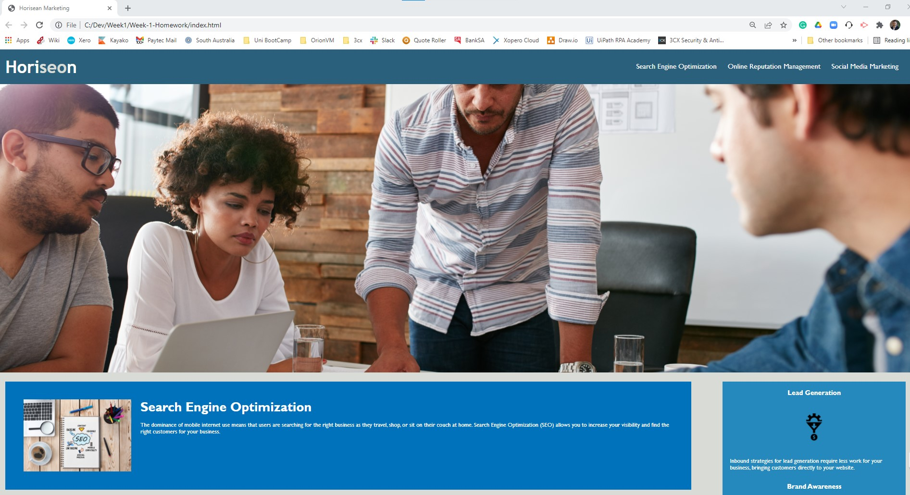

# Week-1-Homework

**About Week-1-Homework**

A Coding Boot Camp is offered through The University of Adelaide in partnership with Trilogy Education Services (Australia) Pty Ltd., a 2U, Inc. brand. This coding bootcamp is a 24-week course and is desinged for students to become a web developer. The course features HTML5, CSS3, JavaScript, jQuery, Bootstrap, Express.js, React.js, Node.js, Database Theory, MongoDB, MySQL, Command Line, Git, and more.

During the first week students are presented with the following concepts.

- GitHub basics
- HTML introdoction
- HTML Attributes
- CSS Color, font and selectors
- HTML Display 
- Box Model
- Positioning 

At the end of each week students are presented with homework for the week to complete putting into pratcice the above concepts. There is also a need to do your own research using resources such as;

- https://www.w3schools.com/ 
- https://stackoverflow.com/
- https://developer.mozilla.org/

**Homework Task**

Students were provided a existing code which included index.html, style.css and images for the site and the objective for the homework was introduce or imporve the code as follows;

- **Refactoring** existing code (improving it without changing what it does) to meet a certain set of standards or to implement a new technology. This is a common task for front-end and junior developers. 
- **Scout Rule** when working with someone else's code, you should always leave the code a little cleaner than when you found it.
- **Accessibility** ensures that people with disabilities can access a website using assistive technologies like video captions, screen readers, and braille keyboards. Accessibility is good for business;for one thing, accessible sites rank higher in search engines like Google. It also helps companies avoid litigation, which might arise if people with disabilities can't access a website.
-**Links** Check all the image links to ensure that the paths worked relative to your local machine folder structure
-**Consolidate CSS** Review and where possible reduce and repetition in styling and place CSS header entries are in a logical structure  
-**Comments** Add comments to HTML and CSS 

**Competed site**

The URL can be found here>> https://mattdryan.github.io/Week-1-Homework/

Following the link you will be presented with "Horiseon Marketing" page similar to the below screenshot.

**Project Goal**

The students must demostrate thier ability to have grasped the HTML/CSS concepts of the week and apply this to this project. Understanding these concepts is very important for the remainder of the course and sets the foundation for the introduction of Javascript in week three. A second purpose of the project is to provide a practicle task to use GIThub repositories and fully understand the process of replicating content from your own computer to the Git repositories. 

**Get started with the project**

**Note**: This project layout is designed for desktop viewing, so you may notice that some of the elements don't look like correct at a resolution smaller than 768px. Students cover this in later weeks.

Use the following Git Document to clone "MattDRyan/Week-1-Homework"  repository >> https://docs.github.com/en/repositories/creating-and-managing-repositories/cloning-a-repository

It is very important that after you have cloned the respository to your local machine to check all the image links in the HTML and CSS code and set the image relative path selected in step five of this guide. 

Here is an example of where the relative paths have been changed in index.html:

>>>>>>>>>>>>>>>>>>>>>>>>>>>>>>>>>>>>>>>>>>>>>>>>>>>>>>>>>>>>>>>>>>>>>>>>>>>>>>>>>>>>>>>>>>>>>>>>>>>>>>>>>>>>>>>>>>>>>>>>>>>>>>>>>>>>>>>>>>

             

                  <!--Old image source to be removed-->
                  <!--  -->
                  <!-- New Image source &  added ALT for accessibility -->
                  
                  <h2>Search Engine Optimization</h2>

>>>>>>>>>>>>>>>>>>>>>>>>>>>>>>>>>>>>>>>>>>>>>>>>>>>>>>>>>>>>>>>>>>>>>>>>>>>>>>>>>>>>>>>>>>>>>>>>>>>>>>>>>>>>>>>>>>>>>>>>>>>>>>>>>>>>>>>>>>

**Need help with the project?**

If you have any questions or need assitance please message me via linkedin on linkedin.com/in/matt-ryan-a4a05154

Contribuitng to the project
While this project formed part of a homework assignment and is unlkely to be developed further, contributions are welcome. 

**Here are guidelines for contributers:**

1) We ask contributors to review all work locally before any Git push to the repository
2) Commits should be squashed
3) Contributors should ask before they make significant changes.
4) Work-in-progress pull requests are ok.

**Licensing Information**

Please see license.md file.

Credits

